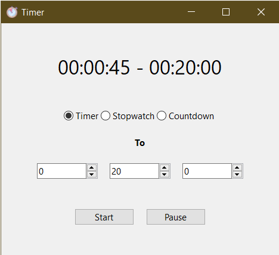

<center style="margin-bottom: 10px;"></center>

Just a tiny little timer written in C.

I mostly wrote this years ago when I was learning C as an exploration of GUI libraries and build systems. It uses a portable library called [IUP](https://en.wikipedia.org/wiki/IUP_(software)) and the [Meson](https://mesonbuild.com/) build system.

It should work on Windows and Linux, but I mostly used it on Windows.

## Building

- [Install Meson and Ninja](https://mesonbuild.com/Getting-meson.html).
- Install [IUP](https://webserver2.tecgraf.puc-rio.br/iup/en/download_tips.html).
- Run `meson build` in the root directory.
- cd into the build directory and run ninja:
    ```
    cd build
    ninja
    ```
- You'll get an executable `timer.exe` (or just `timer`) in the build directory. Copy it along with `alarm.wav` and `timer.ico` to some directory.
- Run and enjoy.


## TODO
- Make alarm in linux version persistent when the window is not focused

## Credit

Icon is probably from https://www.flaticon.com/free-icons/stopwatch
